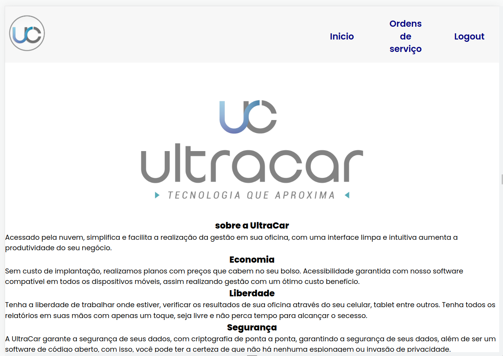

# Ultracar - Frontend Teste

# 📁 Tecnologias #
Esse projeto foi desenvolvido com as seguintes tecnologias e métodos:

* <a href="https://reactjs.org/">React.js</a>
* <a href="https://www.typescriptlang.org/">Javascript</a>
* <a href="https://sass-lang.com/">Sass/CSS</a>
* Mocks

# 💻 Projeto #
O projeto foi desenvolvido para o processo seletivo da Ultracar, onde foi desenvolvido um sistema de cadastro de veiculos, onde o usuario pode ser cliente ou mecanico.
Foi utilizando procedimento de roles para o controle de acesso, padrao de projeto de componentes React.js. Podendo ter uma escalabilidade maior e melhor manutenção do código.
O usuario pode fazer login e logout, e ter acesso a uma pagina de cadastro de veiculos, onde pode cadastrar, editar e excluir veiculos.
O usuario desempenha o papel de cliente, onde pode cadastrar, editar e excluir seus veiculos, ou de mecanico onde pode adicionar descrição, fazer orçamentos e editar o status do veiculo a medida que o mesmo for sendo reparado.

# 🎬 Demonstrações

## Arquitetura

## Projeto

# Iniciando o projeto #
**Clone o projeto para acessá-lo**
~~~
$ git clone git@github.com:estevao144/ProcessoUltracar.git
~~~
A branch mais atualizada é a, então acesse ela por `git checkout main`

**Siga os passos abaixo**
~~~
# Entre na pasta correta para começar
$ cd ultracar/client
~~~

~~~
# Instale as dependências
$ npm install
~~~

~~~
# Rode o projeto
$ npm run dev
~~~

~~~
O app estará disponível na url: http://localhost:5174
~~~
# ✨ Muito obrigado! ✨ #
Code with 💙 by me!, [Estevão Marques](https://www.linkedin.com/in/estevaomarqueso/)